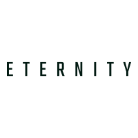
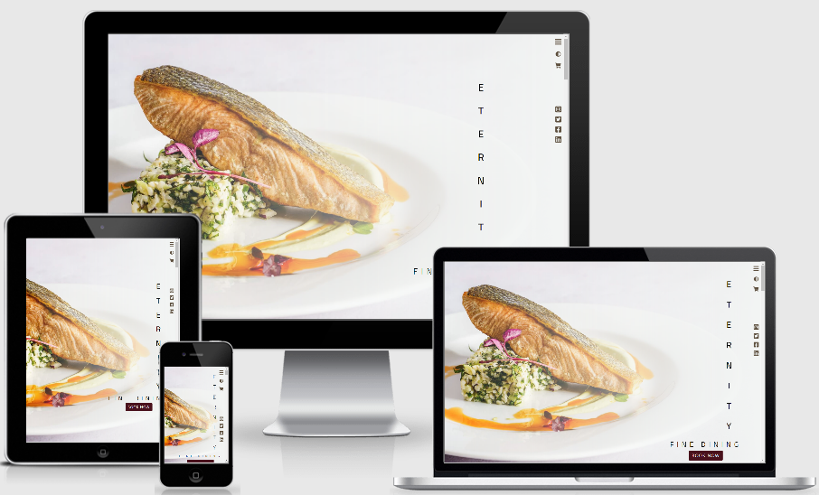
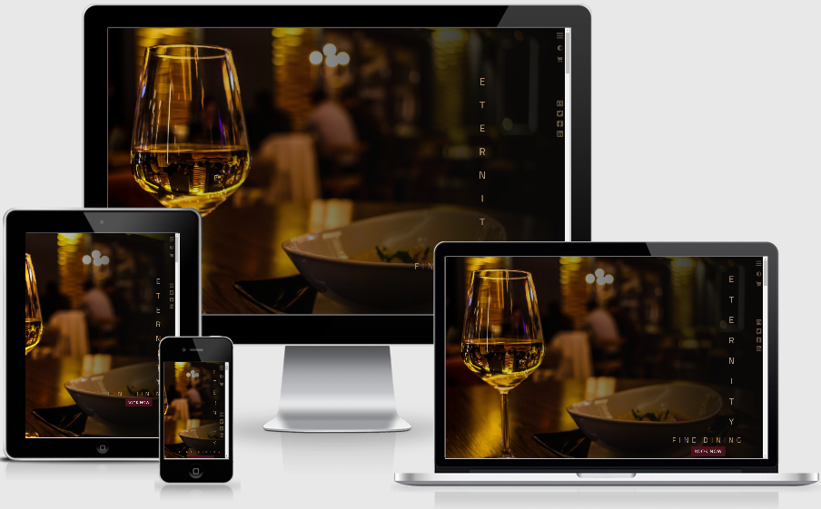
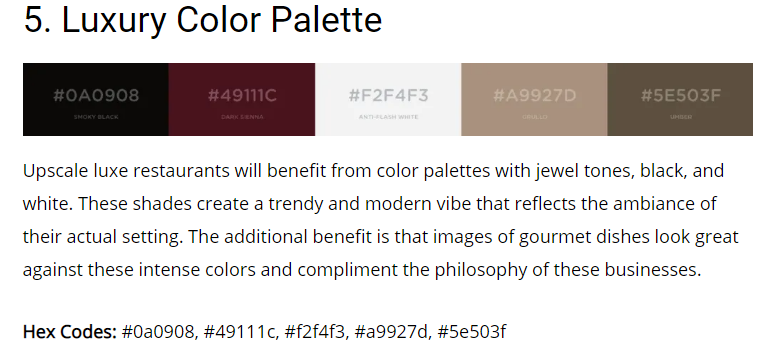

# Eternity

---



---

### Light Mode


### Dark Mode
)

[LIVE DEPLOYMENT OF WEBSITE](https://birrellc.github.io/Eternity-MS2/)

## Description

_this is a fictitious business created for my milestone project 2 with the code institute_.

A luxury minimalist restaurant website designed to convey upper market fine dining experience with high quality food and service. The user of this website will have a taste for high quality foods delivered in a sophisticated environment while eating out but also have the option to eat from home with an online delivery service which i decided to use as thats how many restaurants are managing to survive due to the current pandemic.

_Frontend only - backend databases for reservation and paygate for the online orders to be added as i progress during the course_.

---

## Table of Contents

- [UX](#ux)
  - [Wireframes](#wireframes)
  - [User Stories](#user-stories)
    - [User](#user)
    - [Owner](#owner)
  - [Landing Page](#landing-page)
  - [About](#about)
  - [Menu](#menu)
  - [Reservations](#reservations)
  - [Contact](#contact)
  - [Dividers](#dividers)
  - [Strategy Plane](#strategy-plane)
  - [Scope](#scope)
  - [Structure](#structure)
  - [Skeleton](#skeleton)
  - [Surface](#surface)
    - [Color Scheme](#color-scheme)
    - [Site Images](#site-images)
    - [Fonts](#fonts)
- [Features](#features)
  - [Website Features](#website-features)
  - [Features to be Implemented in the Future](#features-to-be-implemented-in-the-future)
- [Technologies](#technologies)
  - [Languages](#languages)
  - [Libraries, Frameworks & Plugins](libraries-frameworks-&-plugins)
  - [Workspace](#workspace)
  - [External Resources](#external-resources)
- [Testing](#testing)
- [Project Barriers & Bugs](#project-barriers)
  - [Solved](#solved)
  - [Unsolved](#unsolved)
- [Version Control](#version-control)
- [Deployment](#deployment)
  - [Deploy](#deploy)
  - [Clone](#clone)
- [Credits](#credits)
  - [Media](#media)
  - [Credited Code](#credited-code)

---

## UX

---

### Wireframes

The completed wireframes for this project can be accessed by clicking [Wireframes](https://github.com/Birrellc/ms2-ci/tree/master/assets/wireframes).

---

### User Stories

---

#### User:

- As a user of this website i would like to be able to browse what food is available before going to the premises so that i would not be wasting my time if there was no options i wanted.
- As a user, i want to be able to submit feedback to the restaurant of any suggestions, complaints or just to receive more information by email and phone in case my issue is urgent or not so urgent.
- As a user, i want to be able to see what kind of environment the restaurant has through images to see if its the kind of place i would feel comfortable or to see if there is an outdoor area in case i choose to eat here in the summer.
- As a user, i would like the option to book a table online and by telephone so i can make a reservation in whichever manner is convenient to me.
- As a user, i would like to be able to order food online for delivery due to the current state of pandemic and not being comfortable eating out. (coronavirus 2020)
- As a user, i would like to have information about the history of the restaurant available on the website.

---

#### Owner:

- As the owner of this website we would like to show images of our menu to allow customers to see the quality of food and options available.
- As the owner, i would like there to be an option for customers to reach us by email to provide us with any feedback and also have a contact telephone number available for those who prefer.
- As the owner, i would like images to be displayed throughout the site displaying our restaurant environment and also the outdoor area so that customers know they can enjoy an outdoor meal depending on the weather.
- As the owner, i would like there to be a booking form which emails ourselves and the user with details of their reservation as well as a contact number option for booking so customers can book in whichever way is more convenient for them but also to stop clogging up the phones during busy hours.
- As the owner, i would like there to be an option for delivery to help boost sales with customers who are currently preferring to isolate at home rather than eat out in public due to coronavirus 2020.
- As the owner, i would like a section showing our history and who we are as a business to help build a connection with our potential customers.
- As the owner, i would like the website to convey the essence of the business which is luxury & elegant fine dining.

---

### Landing Page

The landing page design i have chosen follows a minimalist approach which will follow throughout the website due to current trends i find minimalism conveys luxury very well. This will consist of a simple image background with a linear gradient over to top of it to not be so overpowering for the user for both light and dark modes which there will be a button in place to toggle between both modes to provide comfort to the viewers/users preference. A title displayed vertically to capture interest with a horizontal sub heading to draw contrast from the heading with a call to action button to book a table below. There will be 3 bar navigation button (hamburger menu) to allow users to open a navigation menu to explore the website or they could scroll down with smooth scrolling and also this allows
users to best experience the website and it's animation effects.

---

### About

The About Us page design is simple but informative - 2 images are placed on the right with a summary of the history of the rest restaurant on the left in order to give the user a view of the experience they will receive in the restaurant and also to provide the user with a view of how the restaurant looks. To the left of these images will be a brief snippet of text explaining how the restaurant started to build an emotional connection with the user.

---

### Menu

The Menu page is nice and simple, the menu options are displayed by images of what the finished dish looks like to provide the user a viewing of the quality food they can expect to receive at the restaurant. Also as the restaurant offers online delivery service an add to basket button is displayed with each menu item for the user to then add to their online order and purchase for delivery if they do so require.

---

### Reservations

The Reservations page is kept very minimalist but informative of all the information the customer requires to book a table at the restaurant while also providing a map of the restaurant location, contact details, address and last but not least a call to action button to allow the customer to book a table at the restaurant.

---

### Contact

This page is a simple form with an image behind it with another linear gradient over to top of it to not be so overpowering for the user, the form on this page will allow the user to contact the restaurant with any complaints, suggestions or questions they may have for the restaurant.

---

### Dividers

The divider pages are used to show more imagery of the restaurant while also breaking up the website to help keep the flow clean and not clutter the experience of the user while also listing words that describe the principles of the restaurant.

---

### Strategy Plane

The purpose of the website created is to entice more customers to the restaurant while displaying the restaurant's core concepts of sophisticated, luxury and elegance to current and new users.

- Showcase the restaurant and its 3 key principles of sophistication, luxury and elegance.
- Showcase the high quality food available at the restaurant - I spoke to a friend whos worked as a Chef in many restaurants throughout the UK/Europe and one of the key comments he made for attracting fine dining customers is quality of food and presentation that stands out from chain restaurants.
- Offer an easy to use online booking form to allow users to reserve a table quickly and efficiently to increase sales & provide phone booking for people who prefer.
- Display social media for proofing and trust from potential customers.
- Obtain user email information via newletter subscription to increase user database and potentially earn more repeat customers through offers and events.
- Design an easy to use website with a minimalism approach to help entice customers through less distractions [Source](https://pos.toasttab.com/blog/on-the-line/restaurant-design-minimalist-design)
- Design mobile responsive website - 81% of customers have searched for a restaurant on a mobile device [Source](https://blogs.constantcontact.com/restaurants-most-searched-industry-by-consumers-on-mobile-devices-and-other-hot-topics/)
- Incorporate an online menu to increase business sales - (51% of customers use a restaurant's website to order food [Image](https://github.com/Birrellc/Eternity-MS2/tree/master/assets/images/readme-images/online-orders-stats.png) [Source](https://pos.toasttab.com/resources/restaurant-success-industry-report))
- Provide an area for feedback, suggestions & questions through a contact form.
- Display the restaurant environment through images displayed throughout the website.
- Display key information for increasing customer interest with location map, address, and opening hours.

---

### Scope

- The website will provide a clean UX / UI for users to use effectively.
- The website will be minimalist, professional and luxury themed to present the business correctly to build trust with current and new clients while creating a solid web foundation for the business to further increase reputation.
- All booking and forms regarding user data must be validated for efficiency and professionalism.
- Project will contain imagery throughout the website to advertise the business throughout.

---

### Structure

- The website is designed to allow viewers/users to quickly understand and view the information displayed without causing distraction which may lead to failure to draw action from the user.
- The information throughout the website will be short and concise to allow the user to quickly navigate the the area they wish to view without distraction while still providing the information they want.
- Areas of user interaction will be clearly displayed to potentially increased sales.

---

### Skeleton

- Minimal Theme Navigation - Navigation will be done through scrolling the pages or by use of a small navigation button \(hamburger button\).
- Design - Each section will have a slight contrast from the previous in order to provide clear separation.
- Dividers - Dividers are used to help split information so as to not over clutter the UX.
- Pages - There will be a Homepage, About page, Menu page, Reservation page & a contact section in that order.
- Iframe - A Google map will be loaded to the page through an iframe, previously this was done with Google maps API but due to only one marker being used i deemed relying on the API unnecessary.

---

### Surface

- Inspiration for the surfact design of the website came from [Pinterest - Food & Restaurant UI/UX](https://www.pinterest.co.uk/sdgates/web-food-restaurant-ui-ux/)

---

#### Color Scheme

- My color scheme inspiration came from an article about restaurant website color schemes [Website](https://abhijitrawool.com/restaurant-website-color-palettes/)



- I picked this color scheme as it supported the website theme of the restaurant which is minimalist & luxury, also with a contrast of light and dark colours allows me to use just one palette for both my light and dark themes on the website.

---

#### Site Images

- All of my images were taken from [Pexels](https://pexels.com) with a contrast of light and dark images to interchange for my light and dark mode themes, luxury food items for my menu, clean stylish indoor and outdoor images of restaurants for my dividers \(this is used to display restaurant environment to users\) and also images of food being prepared and served to generate interest from the user.

---

#### Fonts

- The chosen fonts were originally "Cairo" a sans-serif font & "Parisienne" a cursive font - In the early stages i found the cursive font "Parisienne" to conflict with the minimalism aim for the website which lead me to experiment with alternative secondary fonts for paragraphs in which i decided to test "Oswald", "Leto" & "Raleway" and in the end i chose "Raleway" to be my secondary font for its similarities to "cairo" while still keeping subtle differences.

---

## Features

---

### Website Features

- Scrolling website - 5 Pages \(Home, About, Menu, Reservations & Contact\)
- 3 User Interactive Forms With HTML Validation - Booking form\(modal\) & Contact form will send emails & Basket Form is used for checkout\(At present form only submits to a form dump until my skills develop and then i am able to setup a database to store user payment data, logins, & shopping cart data). Both the Contact form & the Booking Form will have buttons that disable when submitted to prevent spam.
- Interactive Map - Map taken from Google maps iframe showing restaurant location to help makes the business more accessible to customers.
- Online Menu - An online menu has been setup with a JavaScript shopping cart \(items can be added to cart from menu page via buttons then quantity can be adjusted in the shopping cart modal with total price being calculated but due to my lack of skillset the there is no paywall / checkout feature functioning yet but will be added as my skills improve\).
- Animations - Throughout the website their will be animations as the pages switch.
- Social Media - Social media icons will be present on all pages.
- Light / Dark mode - Dark mode option is available due to growing trend of preference.

---

### Features to be Implemented in the Future

- Fully functioning booking form database system to replace the form in place at the moment.
- Fully functioning checkout system to add to the shopping cart for successful online orders.
- The ability to update and alternate menu's with ease.
- Newsletter system with automated response & database to store subscriber email addresses.
- Alternative system to emailJS for sending emails.
- Improve on the features already in place to be more optimal e.g the time and date part of the booking form could self made instead of relying on a plugin.

---

## Technologies

---

### Languages

- [HTML5](https://en.wikipedia.org/wiki/HTML5)
- [CSS3](https://en.wikipedia.org/wiki/CSS)
- [Javascript](https://en.wikipedia.org/wiki/JavaScript)

---

### Libraries Frameworks & Plugins

- [Bootstrap 4](https://getbootstrap.com/)
- [jQuery](https://michalsnik.github.io/aos/)
- [EmailJS](https://www.emailjs.com/)
- [MomentJs](https://momentjs.com/)
- [TempusDominus Time & Date Plugin](https://tempusdominus.github.io/bootstrap-4/)
- [Animate On Scroll](https://michalsnik.github.io/aos/)

---

### Workspace

- [VSCode](https://code.visualstudio.com/)
- [Gitpod](https://www.gitpod.io/)
- [Git](https://git-scm.com/)
- [GitHub](https://github.com/)

---

### External Resources

- [Google Fonts](https://fonts.google.com/) - Used to import fonts for the website.
- [JSHint](https://jshint.com/) - Used to test/validate JavaScript Code.
- [W3C HTML Validator](https://validator.w3.org/) - Used to test/validate HTML code on the website.
- [W3C CSS Validator](https://jigsaw.w3.org/css-validator/) - Used to test/validate the CSS code on the website.
- [Pexels](https://https://www.pexels.com/) - Stock image resource.
- [Tinypng](http://https://tinypng.com/) - Website used to compress my images to allow for faster loading times.
- [Font Awesome](https://fontawesome.com/) - Used to provide small icons for the website. eg. Testimonial quotes section.
- [Stack Overflow](https://fonts.google.com/) - Resource whcih provided the 3 fonts: Anton, Arvo & Montserrat for the website.
- [Google PageSpeed Insights](https://developers.google.com/speed/pagespeed/insights/) - Used to test the loading speed of the website.
- [Responsivley App](https://responsively.app/) - Used to test responsive web apps.
- [Real Favicon Generator](https://realfavicongenerator.net/) - Used to create my favicon image and also test to see if it was working.
- [Spell Checker for Chrome](https://chrome.google.com/webstore/detail/spell-checker-for-chrome/jfpdnkkdgghlpdgldicfgnnnkhdfhocg?hl=en) - Used to spell check my **README.md** & **testing.md**.
- [W3 Schools](https://www.w3schools.com/) - Used as a general resource to help with coding.
- [Am I Responsive](http://ami.responsivedesign.is/) - Used to create mockup of responsive website for **README.md**.
- [Photoshop](https://www.w3schools.com/) - Used to re-scale images.
- [Youtube](https://www.w3schools.com/) - Used as a general resource for help with code.
- [Balsamiq](https://balsamiq.com/wireframes/) - Used to create wireframes.
- [Abhijit Rawool](https://abhijitrawool.com/restaurant-website-color-palettes/) - Used this website to find my color scheme.
- [Markdown Cheat Sheet](https://github.com/adam-p/markdown-here/wiki/Markdown-Cheatsheet) - Used to create my **README.md** & **Testing.md** files.
- [Code Institute](https://codeinstitute.net/) - Main source of coding knowledge.
- Code institute Slack Community - Used for inspiration for my website.

---

## Testing

---

Testing is done in its own section [Here](assets/testing/testing.md).

---

## Project Barriers

---

### Solved

- Slow Loading Speed - I found that when running speed tests my website scored poorly on speed and in order to fix this i compressed my images and also re-scaled the menu images so that the website itself wasn't wasting resources re-scalling each image itself. I also found that if i cache images i could improve my website speed more but due to hosting on github i cannot use server image caching to improve more.

- Animation Page overflow - After adding my animations to my website i found there to be huge overflow issues created. I identified the issue by applying a "1px red border" to all my elements in attempt to find the leak. I managed to overcome this issue by adding "overflow-x:hidden" to my HTML & Body elements with the use of CSS.

- Google Map API not displaying correct information - To fix this problem after trying various ways to fix i eventually took the example code from the documentation and just switched the coordinates to suit my needs. **No longer using Google Maps API switched to Iframe**

- Issues with TotalCost function calculation - I fixed the problem where the total cost was being calculated incorrectly with an if, else statement that would save the current cart price in order for my total cost to be added. Identifying the issue was managed by using console.log to see when the variable was being called & also using breakpoints with dev tools to find out what information was stored in the variable at certain points in the code.

- Only one cart item adding to cart - I fixed this issue by having my objects pushed into an array after being taken out of storage so they could then be pushed to my cart when selected.

---

### Unsolved

- Shopping Cart unintentional spaces remain - When products are deleted unintentional spacing is left in place where items were before and i am currently still trying to figure the best way to remove them while retaining the delete button functionality.

- Shopping Cart error - _Uncaught TypeError: Cannot read property 'name' of undefined
  at HTMLDivElement._ ```   
        cartItems = {
        ...cartItems,
        [item.name]: item
    }; ```
This error only displays occasionally and the shopping cart retains its functionality even when this error appears in console. Unsure of cause of this issue so far.

- Shopping Cart Checkout / login - What i want to be able to do is create a login system so that when users make an order the details are saved to their account and also implement a payment system so that when the checkout form button is submitted the order for the customer will be placed and the shopping cart data will be saved to the customers account. **FEATURE NOT YET IMPLEMENTED DUE TO BEING BEYOND CURRENT SKILL LEVEL**

---

## Version Control

---

- Git was used for version control.
- Branches were only merged once when using IDE on two different devices.

---

## Deployment

---

### Deploy

**_Note: Github has changed master branch names to main - Currently at time of this project the branch name is still referred to as master._**

This project has been deployed on GitHub Pages [Here](https://birrellc.github.io/Eternity-MS2/).

Nearly all of the code was written on VSCode, a local IDE, Gitpod, a cloud based IDE was used briefly when i encountered an issue with my VSCode client.

- First select the repository on GitHub for this project where all the code is stored.
- Then click settings link at the top with the cogwheel icon next to it.
- Scroll down till reaching the GitHub Pages Heading.
- Locate the source section and click on branch master then select the master branch.
- This will then publish the project to GitHub Pages and display the URL of the live website. (may have to refresh and scroll back to this section to see the URL)
- The deployed website version will be tracked to your last commit so if you have made changes without committing and pushing them to github those changes will not be live.

---

### Clone

- The code itself can be cloned or downloaded to your local pc for editing also.
- To do this navigate back to the [Repository page](https://github.com/Birrellc/Eternity-MS2).
- Select the clone option at the top right of the Respository.
- From here you will be able to download the download the code and open it locally on your PC with your own IDE.
- You can also clone the code by copying the link provided when the clone drop down menu is opened.
- The method i used was cloning by the link provided - I first downloaded [Git](https://git-scm.com/), after that i opened VSCode and selected the **git clone** option after pressing F1 and pasted the URL into the box.
- You can also open your terminal in your local IDE, Change the current working directory to where you want the clone to be made then type **git clone** in the terminal and paste the link after for e.g "git clone https://github.com/Birrellc/Eternity-MS2".

---

## Credits

---

- First Credits go to my mentor Felipe Alarcon for guidance and advice on how to get this project submission ready.
- Code institute for providing the content and support to help learn and develop my skills.
- Code Institute slack community members for help, ideas & feedback from code reviews.
- Michael Prothero for taking the time to let me bounce ideas and offer general support with my project.
- [Udemy](https://www.freecodecamp.org/) & [FreeCodeCamp](https://www.freecodecamp.org/) courses also helped provide understanding of ES6.

---

### Media

- All Images on this project were taken from [Pexels](https://https://www.pexels.com/)

---

### Credited Code

- [Bootstrap - examples](https://getbootstrap.com/docs/4.0/examples/checkout/) - This is the code used for my modal checkout form.
- [Stack Overflow - Forum](https://stackoverflow.com/questions/64308378/best-way-to-break-up-a-function-javascript) - I was looking for the best way to refactor a function that worked but had bad readability. - credited in code
- [Stack Overflow - Forum](https://stackoverflow.com/a/64688795/14580125) - I had a JavaScript error when running my code through jsHint which after researching i found that it was a false positive so i made a post on stack overflow in order to get somebody to confirm that my code was fine and that it was indeed a false positive. Also in this post i was having an issue with getting an "in" statement to work and the stack overflow community helped me by explaning how to fix it here. - Credited in code.
- [Shopping Cart Tutorial](https://www.youtube.com/watch?v=IY5UN82FZ2Q) - This is the tutorial i used to get a starting point on my shopping cart - The code has been modified & some features completely done my own way without using the tutorial code - credited at the top of online-order.js.
- [Tempus Dominus Documentation](https://tempusdominus.github.io/bootstrap-4/) - Without the documentation resource i wouldnt have been able to set up the time and date plugin correctly for the operational hours of the business.
- [Code Institute](https://codeinstitute.net/) - For teaching me the code required to complete this project. e.g. The emailJS code stems from the emailJS section of the Code Institute course. - Mentioned in emailJS.js code
